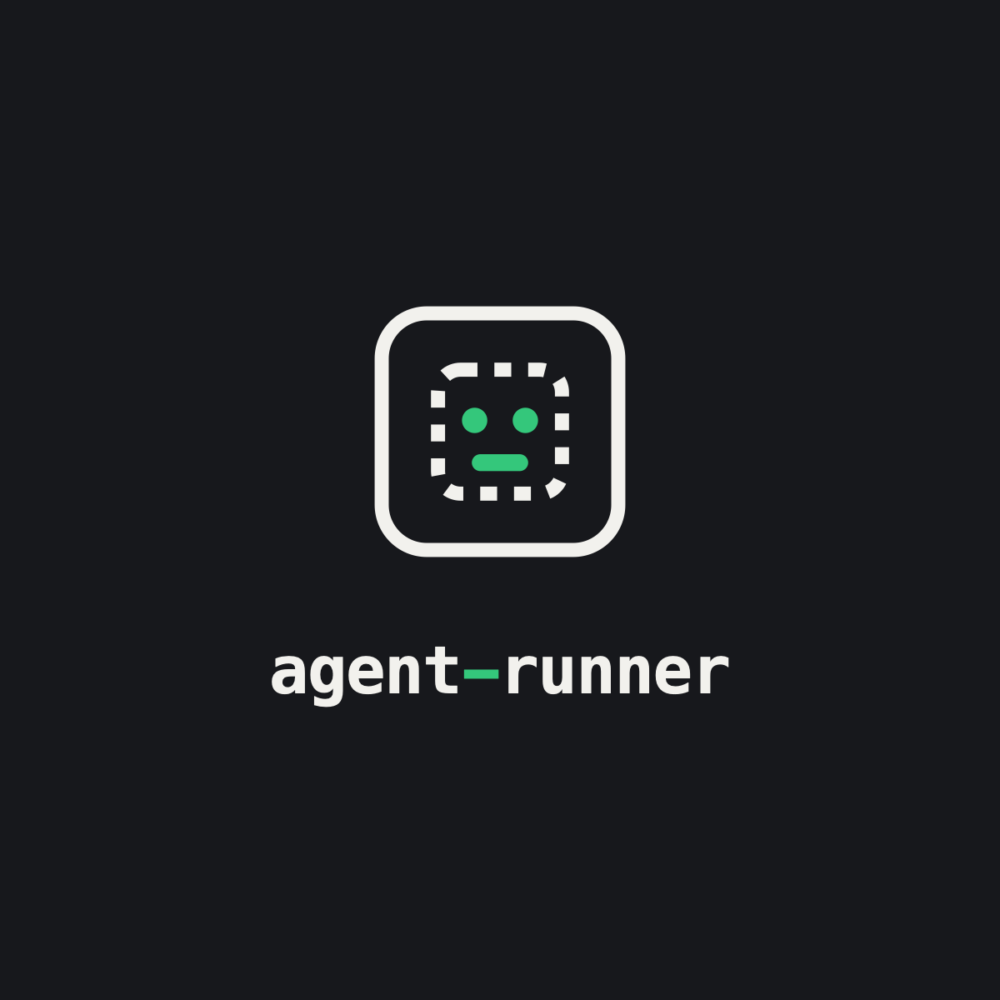

  

# agent-runner

A cloud platform for running [Claude Code](https://claude.com/claude-code) / Claude Agent SDK
agents in containers: spin up a fresh container, run one agent session (minutes to tens of
minutes), tear down. Not a long-lived request-serving service — no idle/warm pool, secrets
injected once at container start.

Scoped to this single repo; no multi-tenant design needed.

## Status

Early — this repo currently holds the spec/research effort (target cloud platform, sandbox
isolation guarantees) rather than a working implementation. See `docs/research/` for the
primary-source research behind the design decisions so far.

## Docs

- `docs/research/cloud-target-platform.md` — comparison of candidate platforms (Fargate, Fly
  Machines, Modal, E2B, Cloud Run Jobs, etc.) for running agent containers.
- `docs/research/isolation-mechanism.md` — sandbox/isolation guarantees for GitHub Actions
  hosted runners.
- `docs/agents/` — how agent skills should use this repo (issue tracker, triage labels, domain
  docs).
- `docs/triggering.md` — how to fire an agent run, via the reusable
  `agent-run-trigger.yml` workflow or directly via `repository_dispatch`,
  trigger-token custody/rotation policy, and provisioning steps for the repo
  owner.
- `docs/default-phases/` — fallback phase instructions the agent uses when a
  target repo has no `docs/agent-phases/<phase>.md` of its own.

## Contributing

Issues are tracked on GitHub (see `docs/agents/issue-tracker.md`); pull requests are not a
triage surface.
